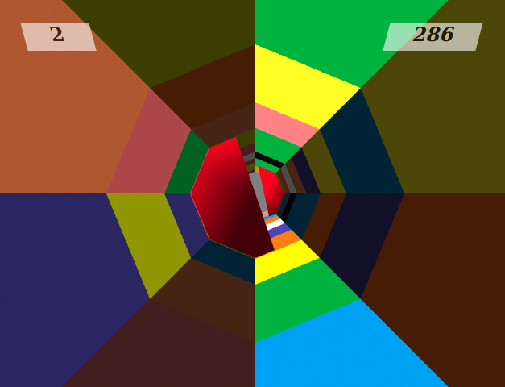

Tunnel Rush Webgl 3D Game
=========================
This game is based on [Tunnel Rush]( http://www.y8.com/games/Tunnel_Rush).  More details in [problem.pdf](Assignment-3.pdf). 



The prime objective is to score as much as possible. After a certain score is reached, new level is unlocked with some additional features increasing the difficulty of the game. 

[TOC]

### Installation
--------

You don't need to install any packages for running the code.

####Run the code
--------

```bash
cd path/to/project
firefox index.html
```

###World
-----

1. **Octahedral Infinite Tunnel** - The infinite tunnel consists of octagons, stacked one over another. The view is perspective so the stacked octagons look a tunnel. When an octagon gets passed the viewing screen, I remove it and add a new octagon at the end.
2. **Obstacles** - Tunnel has got obstracles moving and rotating at random speeds. There are 4 different types of obstracles. New obstracles come after passing each level.

**Level** is indicated by  on **top left** side of canvas window.

**Score** is displayed on **top right** side of canvas  window.

### Controls

------

- Arrow keys (Left/Right) or A/D  - Rotate the tunnel
- Z/X - Move camera left/right
- N/M - Move camera up/down
- P - Pause
- B - Black and White

###Extra Features
------

- Game UI (Score and Level display)
- Infinite boundary
- Background music
- Textures for making tunnel walls and obstacles
- Shadering effects on obstacles
- Lightening effects which changes on rotation of tunnel
- Camera
- 4 Different types of obstacles
- Modular codebase

###License

-----

Music Credits: Eric Matyas (http://www.soundimage.org)